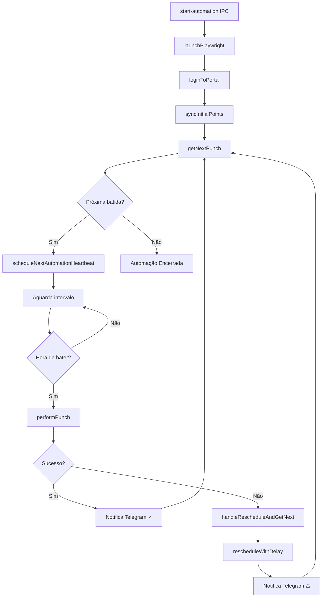
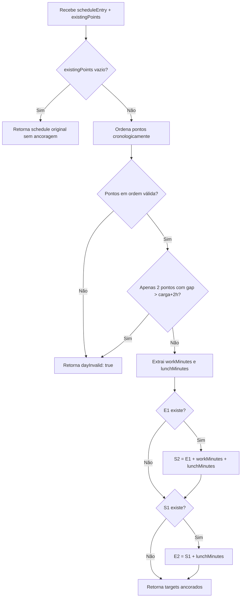
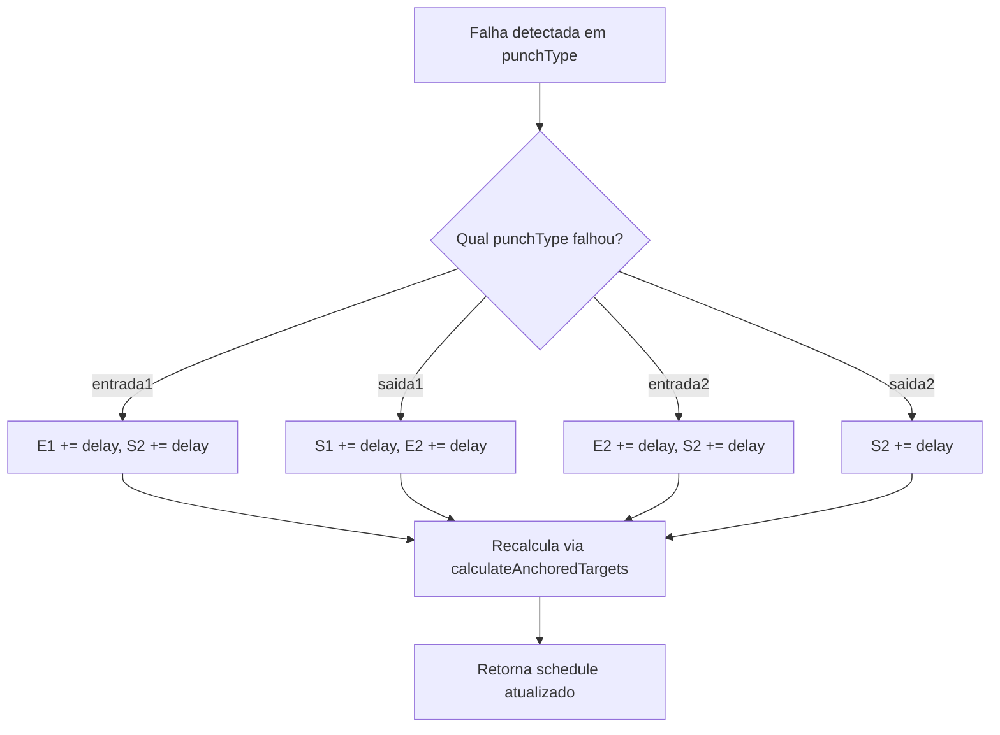
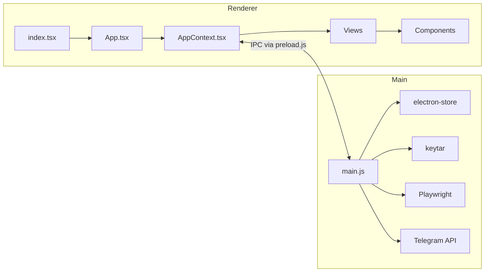
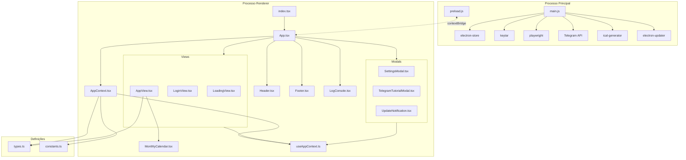
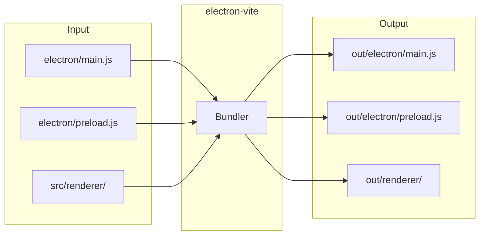

# Documentação Técnica Completa: MeuPonto

**Versão:** 3.0.0 (Exaustiva)
**Última Atualização:** 20/01/2026
**Escopo:** Documentação função-a-função de TODOS os arquivos em `electron/*` e `src/renderer/*`

---

## Sumário

1. [Processo Principal (electron/)](#1-processo-principal-electron)
   - [1.1 main.js](#11-mainjs)
   - [1.2 preload.js](#12-preloadjs)
2. [Processo de Renderização (src/renderer/)](#2-processo-de-renderização-srcrenderer)
   - [2.1 Ponto de Entrada](#21-ponto-de-entrada)
   - [2.2 Contexto e Hooks](#22-contexto-e-hooks)
   - [2.3 Tipos e Constantes](#23-tipos-e-constantes)
   - [2.4 Views](#24-views)
   - [2.5 Componentes](#25-componentes)

---

## 1. Processo Principal (electron/)

### 1.1 main.js

**Arquivo:** `electron/main.js`
**Linhas:** 2469
**Função:** Controlador principal da aplicação Electron. Gerencia ciclo de vida, automação Playwright, persistência, credenciais seguras e comunicação IPC.

---

#### 1.1.1 Imports e Variáveis Globais (Linhas 1-31)

```javascript
const { app, BrowserWindow, ipcMain, dialog, Notification, powerSaveBlocker, shell } = require('electron');
const fs = require('fs');
const path = require('path');
const Store = require('electron-store');
const keytar = require('keytar');
const { expect } = require('playwright/test');
const { autoUpdater } = require('electron-updater');
const { exec, fork, execSync, spawn } = require('child_process');
```

**Variáveis Globais:**
| Variável | Tipo | Descrição |
|----------|------|-----------|
| `mainWindow` | `BrowserWindow \| null` | Referência à janela principal |
| `automationIsRunning` | `boolean` | Flag de controle do loop de automação |
| `automationTimers` | `Array<NodeJS.Timeout>` | Array de timers ativos para cleanup |
| `activeBrowserExecutablePath` | `string \| null` | Caminho do Chromium encontrado |
| `playwrightBrowser` | `Browser \| null` | Instância do navegador Playwright |
| `automationSchedule` | `Schedule` | Grade de horários em memória |
| `userCredentials` | `UserCredentials` | Credenciais do usuário logado |

**Constantes de Tempo:**
- `CINCO_MINUTOS`: 300000ms
- `UM_MINUTO`: 60000ms
- `CINCO_SEGUNDOS`: 5000ms

---

#### 1.1.2 Funções Auxiliares de Log (Linhas 39-159)

##### `logToRenderer(level: string, message: string): void`
**Propósito:** Envia logs do processo principal para o renderer via IPC.
**Parâmetros:**
- `level`: Nível do log (`INFO`, `SUCESSO`, `AVISO`, `ERRO`, `DEBUG`)
- `message`: Mensagem a ser enviada
**Fluxo de Execução:**
1. Verifica se logs detalhados estão habilitados
2. Se desabilitados e level é `DEBUG`, ignora
3. Simplifica mensagem técnica para usuários comuns
4. Envia via `mainWindow.webContents.send('log-from-main', {...})`
5. Também imprime no console do terminal

##### `simplifyLogMessage(level: string, message: string): string | null`
**Propósito:** Converte mensagens técnicas em mensagens amigáveis.
**Retorno:** String simplificada ou `null` (para ignorar a mensagem)
**Lógica:** Usa um mapa de simplificações para traduzir mensagens como:
- `'Iniciando busca abrangente...'` → `'Procurando navegador...'`
- `'NPX encontrado em:'` → `'Navegador encontrado.'`

##### `updateAutomationStatusInRenderer(statusMessage, currentTask, isRunning): void`
**Propósito:** Atualiza a barra de status da UI.
**Evento IPC:** `automation-status-update`

---

#### 1.1.3 IPC Handlers de Persistência (Linhas 161-211)

##### `ipcMain.handle('load-settings')`
**Propósito:** Carrega configurações salvas.
**Retorno:** `Promise<Settings | undefined>`
**Origem:** `electron-store` (JSON no disco)

##### `ipcMain.on('save-settings', (event, settings))`
**Propósito:** Salva configurações.
**Padrão:** Fire-and-forget (sem retorno)

##### `ipcMain.handle('load-schedule')`
**Propósito:** Carrega grade de horários salva.

##### `ipcMain.on('save-schedule', (event, schedule))`
**Propósito:** Persiste grade de horários.

##### `ipcMain.handle('get-credential', async (event, account))`
**Propósito:** Recupera senha do keychain do SO.
**Integração:** `keytar.getPassword()`

##### `ipcMain.on('set-credential', async (event, { account, password }))`
**Propósito:** Salva credencial no keychain seguro.
**Integração:** `keytar.setPassword()`

##### `ipcMain.on('delete-credential', async (event, account))`
**Propósito:** Remove credencial do keychain.

---

#### 1.1.4 Gerenciamento do Navegador Playwright (Linhas 216-461)

##### `findChromiumDir(): string | null`
**Propósito:** Busca diretório `chromium-*` na pasta local de browsers.
**Retorno:** Caminho absoluto ou `null`

##### `findAllPossibleBrowserPaths(): string[]`
**Propósito:** Gera lista de todos os locais onde o Chromium pode estar instalado.
**Locais verificados:**
1. `app.getPath('userData')/playwright-browsers` (prioridade máxima)
2. Cache padrão do Playwright por OS
3. `PLAYWRIGHT_BROWSERS_PATH` env var
4. API do Playwright (`chromium.executablePath()`)
5. npm global
6. Dentro do .asar (se empacotado)

##### `findChromiumExecutable(browserPath: string): string | null`
**Propósito:** Localiza o executável dentro de um diretório de browser.
**Lógica por SO:**
- **Windows:** Busca `chrome.exe` em `chrome-win/` ou `chrome-win64/`
- **macOS:** Busca `Chromium.app/Contents/MacOS/Chromium`
- **Linux:** Busca `chrome` ou `chromium` em `chrome-linux/`

##### `checkPlaywrightBrowser(silentMode = false): Promise<'OK' | 'MISSING'>`
**Propósito:** Verifica disponibilidade do navegador.
**Fluxo:**
1. Verifica cache salvo (`lastKnownBrowserPath`)
2. Consulta API do Playwright
3. Busca manual em todos os paths
4. Salva resultado encontrado

---

#### 1.1.5 Verificação de Node.js/NPM (Linhas 557-713)

##### `checkNodeAndNpm(): Promise<NodeNpmCheck>`
**Propósito:** Verifica instalação de Node.js e NPM.
**Retorno:** `{ status: 'OK' | 'OUTDATED' | 'MISSING', nodeVersion, npmVersion, message }`
**Lógica:**
1. Expande PATH com caminhos comuns (Homebrew, NVM, etc.)
2. Executa `node --version` e `npm --version`
3. Valida versão mínima (Node >= 18)

##### `getExpandedPath(): string`
**Propósito:** Adiciona caminhos comuns de instalação ao PATH.
**Caminhos incluídos:**
- `/usr/local/bin`, `/opt/homebrew/bin`
- Diretórios NVM
- Caminhos Windows (`C:\Program Files\nodejs`, etc.)

##### `alternativeNodeCheck(pathEnv): Promise<NodeNpmCheck>`
**Propósito:** Fallback de verificação direta de arquivos executáveis.

---

#### 1.1.6 Instalação do Navegador (Linhas 754-1033)

##### `ipcMain.on('reinstall-automation-browser')`
**Propósito:** Inicia processo de instalação do Chromium.
**Fluxo:**
1. Cria diretório local para browsers
2. Define `PLAYWRIGHT_BROWSERS_PATH`
3. Tenta instalação via spawn (`npx playwright install chromium`)
4. Fallback para `execPromise`
5. Verifica resultado após instalação
6. Mostra diálogo de erro com opções se falhar

##### `installChromiumViaSpawn(installPath): Promise<void>`
**Propósito:** Executa instalação usando `child_process.spawn`.
**Vantagem:** Mais controle sobre stdout/stderr em tempo real.

##### `showManualInstallInstructions(): void`
**Propósito:** Exibe diálogo com instruções de instalação manual.

---

#### 1.1.7 Notificações Telegram (Linhas 1036-1120)

##### `sendTelegramNotification(token, chatId, message): Promise<void>`
**Propósito:** Envia mensagem de texto via Bot API do Telegram.
**Método HTTP:** POST para `api.telegram.org/bot{token}/sendMessage`

##### `sendTelegramPhoto(token, chatId, photoPath, caption): Promise<void>`
**Propósito:** Envia screenshot como foto.
**Método HTTP:** POST multipart/form-data para `/sendPhoto`

---

#### 1.1.8 Geração de Calendário (Linhas 1122-1243)

##### `generateCalendarFile(schedule): Promise<string>`
**Propósito:** Gera arquivo `.ics` com eventos de ponto.
**Biblioteca:** `ical-generator`
**Lógica:**
1. Calcula semana atual (segunda a sexta)
2. Para cada dia não-feriado, cria 4 eventos (E1, S1, E2, S2)
3. Adiciona alarmes de 5min e 1min antes
4. Salva em `userData/registro-ponto.ics`

##### `ipcMain.handle('export-calendar', async (event, schedule))`
**Propósito:** Handler IPC para exportação.
**Retorno:** `{ success: boolean, path?: string, error?: string }`

---

#### 1.1.9 Lógica de Automação Core (Linhas 1245-2218)

##### `runAutomationStep(stepFunction, ...args): Promise<StepResult>`
**Propósito:** Wrapper com retry automático para passos de automação.
**Parâmetros:**
- `stepFunction`: Função assíncrona a executar
- `args`: Argumentos para a função
**Lógica de Retry:**
- Até `MAX_RETRIES` (3) tentativas
- Intervalo crescente: `RETRY_INTERVAL * tentativa`
- Envia notificação Telegram em falha crítica

##### `launchPlaywright(): Promise<Browser>`
**Propósito:** Inicia instância do navegador.
**Configuração:**
```javascript
playwright.chromium.launch({
  headless: true,
  executablePath: activeBrowserExecutablePath,
  args: ['--no-sandbox', '--disable-setuid-sandbox']
})
```

##### `closePlaywright(): Promise<void>`
**Propósito:** Fecha navegador e limpa referência.

##### `loginToPortal(page, folha, senha): Promise<void>`
**Propósito:** Realiza login no portal Central do Funcionário.
**Fluxo:**
1. Navega para `https://centraldofuncionario.com.br/50911`
2. Preenche campos `#login-numero-folha` e `#login-senha`
3. Clica em `#login-entrar`
4. Aguarda navegação para `/incluir-ponto`
5. Verifica texto "Incluir Ponto" na página

##### `syncInitialPoints(page): Promise<string[]>`
**Propósito:** Lê pontos já registrados hoje.
**Retorno:** Array de strings no formato `['HH:MM', 'HH:MM', ...]`
**Scraping:** Seleciona elementos `[id^="status-processamento-"]`, extrai datas/horários.

##### `extractScheduleParameters(scheduleEntry): { lunchMinutes, workMinutes }`
**Propósito:** Calcula duração de almoço e trabalho a partir do schedule.
**Fórmulas:**
- `lunchMinutes = entrada2 - saida1`
- `workMinutes = (saida2 - entrada1) - lunchMinutes`

##### `calculateAnchoredTargets(scheduleEntry, existingPoints): AnchoredTargets`
**Propósito:** **ALGORITMO PRINCIPAL DE ANCORAGEM**
**Lógica Detalhada:**
1. Se não há pontos registrados → retorna schedule original (sem ancoragem)
2. Valida ordem cronológica dos pontos (t[i] < t[i+1])
3. Se apenas 2 pontos com diferença > carga esperada + 2h → dia inválido
4. Aplica ancoragem:
   - Se existe E1: `S2 = E1 + workMinutes + lunchMinutes`
   - Se existe S1: `E2 = S1 + lunchMinutes`
5. Retorna targets calculados com flag `anchored: true`

##### `rescheduleWithDelay(currentSchedule, failedPunchType, delayMinutes, existingPoints): Schedule`
**Propósito:** Recalcula horários após falha.
**Propagação de Atraso:**
- Falha em E1 → E1 e S2 +10min
- Falha em S1 → S1 e E2 +10min
- Falha em E2 → E2 e S2 +10min
- Falha em S2 → S2 +10min

##### `getNextPunch(currentSchedule, existingPoints): NextPunch | null`
**Propósito:** Determina próxima batida a realizar.
**Retorno:** `{ day, type, time, dateTime }` ou `null`
**Lógica:**
1. Itera pelos próximos 7 dias
2. Para cada dia, calcula targets ancorados
3. Para cada punchType não realizado, verifica se horário ainda não passou
4. Respeita `preAssignedInterval` (pula S1 e E2)

##### `performPunch(page, punchDetails): Promise<'success'>`
**Propósito:** Executa registro de ponto.
**Fluxo:**
1. **Verificação Preventiva:** Checa se ponto já existe
2. Clica em `#localizacao-incluir-ponto`
3. **Polling de Verificação:** Até 10 tentativas com intervalo de 5s
4. Valida por horário exato OU aumento na quantidade
5. Envia notificação Telegram de sucesso/falha

##### `calcHeartbeatInterval(ms): number`
**Propósito:** Calcula intervalo do próximo heartbeat.
**Lógica:**
- Se > 5min → retorna 5min
- Se > 1min → retorna 1min
- Se < 1min → retorna max(ms, 5s)

##### `scheduleNextAutomationHeartbeat(nextPunch): void`
**Propósito:** Agenda próxima verificação/batida.
**Usa:** `setTimeout` recursivo (não `setInterval`)

---

#### 1.1.10 IPC Handlers de Automação (Linhas 2221-2287)

##### `ipcMain.on('start-automation', async (event, { schedule, credentials, settings }))`
**Propósito:** Inicia ciclo de automação.
**Ações:**
1. Define flags de estado
2. Lança Playwright
3. Sincroniza e agenda primeira batida

##### `stopAutomationLogic(): Promise<void>`
**Propósito:** Para automação e limpa recursos.
**Ações:**
1. Define `automationIsRunning = false`
2. Limpa todos os timers
3. Fecha Playwright

##### `ipcMain.on('stop-automation')`
**Propósito:** Handler IPC para interrupção.

---

#### 1.1.11 Ciclo de Vida do App (Linhas 2290-2400)

##### `createWindow(): void`
**Propósito:** Cria janela principal.
**Configuração:**
```javascript
{
  width: 1100, height: 1000,
  minWidth: 1000, minHeight: 900,
  webPreferences: {
    preload: path.join(__dirname, 'preload.js'),
    nodeIntegration: false,
    contextIsolation: true
  }
}
```

##### `startNoSleep() / stopNoSleep()`
**Propósito:** Previne suspensão do sistema durante automação.
**API:** `powerSaveBlocker.start('prevent-app-suspension')`

##### `app.whenReady()`
**Ações:**
1. Inicia NoSleep
2. Cria janela
3. Verifica atualizações (`autoUpdater.checkForUpdates()`)

##### `app.on('will-quit')`
**Propósito:** Cleanup antes de fechar.
**Ações:** Chama `stopAutomationLogic()`

---

### 1.2 preload.js

**Arquivo:** `electron/preload.js`
**Linhas:** 88
**Função:** Ponte segura entre renderer e main process.

#### API Exposta via `contextBridge.exposeInMainWorld('electronAPI', {...})`

| Método | Tipo | Descrição |
|--------|------|-----------|
| `minimizeWindow()` | void | Minimiza janela |
| `maximizeWindow()` | void | Maximiza/restaura janela |
| `closeWindow()` | void | Fecha janela |
| `loadSettings()` | Promise | Carrega configurações |
| `saveSettings(settings)` | void | Salva configurações |
| `loadSchedule()` | Promise | Carrega grade |
| `saveSchedule(schedule)` | void | Salva grade |
| `getCredential(account)` | Promise<string> | Obtém senha do keychain |
| `setCredential(account, password)` | void | Salva credencial |
| `deleteCredential(account)` | void | Remove credencial |
| `checkNodeNpm()` | Promise | Verifica Node.js/NPM |
| `openNodeJSDownload()` | Promise | Abre página de download |
| `getAppVersion()` | Promise<string> | Retorna versão do app |
| `checkAutomationBrowser()` | Promise | Verifica Playwright |
| `getBrowserPath()` | Promise<string> | Retorna caminho do browser |
| `reinstallAutomationBrowser()` | void | Reinstala browser |
| `onBrowserStatusUpdate(callback)` | cleanup | Listener de status |
| `startAutomation(data)` | void | Inicia automação |
| `stopAutomation()` | void | Para automação |
| `exportCalendar(schedule)` | Promise | Exporta .ics |
| `onLogFromMain(callback)` | cleanup | Listener de logs |
| `onAutomationStatusUpdate(callback)` | cleanup | Listener de status |
| `downloadUpdate()` | void | Inicia download |
| `installUpdate()` | void | Reinicia e instala |
| `onUpdateAvailable(callback)` | cleanup | Listener update available |
| `onUpdateProgress(callback)` | cleanup | Listener progresso |
| `onUpdateDownloaded(callback)` | cleanup | Listener download completo |

**Padrão de Listeners:**
```javascript
onLogFromMain: (callback) => {
  const handler = (_event, logEntry) => callback(logEntry);
  ipcRenderer.on('log-from-main', handler);
  return () => ipcRenderer.removeListener('log-from-main', handler);
}
```

---

## 2. Processo de Renderização (src/renderer/)

### 2.1 Ponto de Entrada

#### index.tsx (18 linhas)
**Função:** Bootstrap do React.
```typescript
const root = ReactDOM.createRoot(rootElement);
root.render(<React.StrictMode><App /></React.StrictMode>);
```

#### App.tsx (70 linhas)
**Função:** Componente raiz que monta a estrutura da aplicação.

##### `ViewRenderer: React.FC`
**Propósito:** Renderiza view baseada no estado.
**Switch:** `LOADING_PREREQUISITES` → `NODE_MISSING` → `NODE_INSTALL` → `LOGIN` → `APP_VIEW`

##### `AppContent: React.FC`
**Propósito:** Layout principal.
**Estrutura:**
- Header
- main (ViewRenderer)
- LogConsole
- Footer
- Modais (Settings, Telegram, Update)

##### `App: React.FC`
**Propósito:** Wrapper com Provider.
```tsx
<AppProvider><AppContent /></AppProvider>
```

---

### 2.2 Contexto e Hooks

#### AppContext.tsx (195 linhas)

##### Interface `AppContextType`
| Campo | Tipo | Descrição |
|-------|------|-----------|
| `currentView` | View | View ativa |
| `setCurrentView` | function | Navegar entre views |
| `settings` | Settings | Configurações |
| `updateSettings` | function | Atualizar e persistir |
| `logs` | LogEntry[] | Buffer de logs |
| `addLog` | function | Adicionar log |
| `clearLogs` | function | Limpar logs |
| `theme` | 'light' \| 'dark' | Tema ativo |
| `toggleTheme` | function | Alternar tema |
| `schedule` | Schedule | Grade semanal |
| `automationMode` | AutomationMode | Modo ativo |
| `automationState` | AutomationState | Estado da automação |
| `isSettingsModalOpen` | boolean | Controle do modal |
| `currentUserCredentials` | UserCredentials | Credenciais logadas |

##### `AppProvider: React.FC<{children}>`
**Estados:**
- `settings`, `logs`, `theme`, `schedule`, `automationMode`, `automationState`, `modals`, `credentials`

**Callbacks Memoizados:**
- `addLogCallback`: Adiciona log com timestamp
- `updateSettingsCallback`: Atualiza e persiste via IPC
- `updateScheduleEntryCallback`: Atualiza dia específico
- `clearLogsCallback`: Limpa e adiciona log de confirmação

**Effects:**
1. **Mount:** Carrega settings/schedule do electron-store
2. **Mount:** Registra listeners IPC para logs e status
3. **Theme:** Atualiza classes no `document.documentElement`

#### useAppContext.ts (12 linhas)
```typescript
export const useAppContext = () => {
  const context = useContext(AppContext);
  if (context === undefined) {
    throw new Error('useAppContext must be used within an AppProvider');
  }
  return context;
};
```

---

### 2.3 Tipos e Constantes

#### types.ts (145 linhas)

**Enums:**
```typescript
enum LogLevel { INFO, SUCCESS, WARNING, ERROR, DEBUG }
enum View { LOADING_PREREQUISITES, NODE_MISSING, NODE_INSTALL, LOGIN, APP_VIEW }
enum BrowserStatus { LOADING, OK, MISSING }
enum NodeStatus { LOADING, OK, OUTDATED, MISSING }
enum DayOfWeek { MONDAY, TUESDAY, WEDNESDAY, THURSDAY, FRIDAY }
enum AutomationMode { WEEKLY_MANUAL, WEEKLY_AUTO, MONTHLY_AUTO }
```

**Interfaces:**
```typescript
interface Settings {
  telegramChatId: string;
  showLogConsole: boolean;
  automationBrowserStatus: BrowserStatus;
  theme: 'light' | 'dark';
  saveLoginDetails: boolean;
  savedFolha: string;
  detailedLogs?: boolean;
  autoRegenerateSchedules?: boolean;
  preAssignedIntervalConfig?: Record<string, boolean>;
}

interface TimeEntry {
  entrada1: string;
  saida1: string;
  entrada2: string;
  saida2: string;
  feriado: boolean;
}

type Schedule = Record<DayOfWeek, TimeEntry>;

interface ElectronAPI { /* 23 métodos - ver preload.js */ }
```

#### constants.ts (52 linhas)
```typescript
export const INITIAL_SETTINGS: Settings = { /* valores padrão */ };
export const INITIAL_VIEW = View.LOADING_PREREQUISITES;
export const DAYS_OF_WEEK = [MONDAY, TUESDAY, WEDNESDAY, THURSDAY, FRIDAY];
export const EMPTY_TIME_ENTRY: TimeEntry = { entrada1: '', ... };
export const INITIAL_SCHEDULE = DAYS_OF_WEEK.reduce(...);
export const LOG_LEVEL_COLORS: Record<LogLevel, string> = { /* classes Tailwind */ };
export const APP_TITLE = "Meu Ponto";
```

---

### 2.4 Views

#### LoadingView.tsx (137 linhas)
**Função:** Tela de splash com verificação de pré-requisitos.

**Estados:**
- `statusMessage`, `detailedChecksDone`, `nodeCheckDone`, `nodeCheck`

**Effect (mount):**
1. Verifica Node.js via `checkNodeNpm()`
2. Se MISSING → direciona para NODE_INSTALL
3. Verifica Playwright via `checkAutomationBrowser()`
4. Atualiza settings com status do browser
5. Aguarda 1.5s e navega para LOGIN

---

#### LoginView.tsx (184 linhas)
**Função:** Tela de autenticação.

##### `handleLogin(e: React.FormEvent): Promise<void>`
**Fluxo:**
1. Valida campos obrigatórios
2. Define credenciais no contexto
3. Se "Lembrar": salva via `setCredential()`
4. Se desmarcou "Lembrar": remove via `deleteCredential()`
5. Navega para APP_VIEW

**Effect (mount):**
- Carrega credenciais salvas se `saveLoginDetails` está ativo

---

#### AppView.tsx (782 linhas)
**Função:** **TELA PRINCIPAL** - Grade de horários e controles de automação.

##### Estados Locais:
- `weeklyManualSchedule`, `weeklyAutoSchedule`, `monthlyAutoSchedule`
- `initialHourWeeklyAuto`, `initialHourMonthlyAuto`

##### `DayRowEditor` (sub-componente, linhas 8-74)
**Props:** `day`, `entry`, `onChange`, `readonly`, `preAssignedInterval`
**Funções:**
- `addHoursToTime()`: Calcula horário + delta
- `handleTimeChange()`: Atualiza e propaga (E1 → S2, S1 → E2)
- `handleFeriadoChange()`: Limpa horários ao marcar feriado

##### `renderPreAssignedIntervalToggle(mode, compact)`
**Propósito:** Renderiza toggle de pré-assinalação.
**Lógica:** Atualiza `settings.preAssignedIntervalConfig[mode]`

##### `generateMonthlyAutoSchedule(baseStartTime)`
**Propósito:** Gera horários únicos para o mês inteiro.
**Lógica:**
1. Para cada dia útil do mês atual
2. Gera E1 com minuto aleatório (base + random)
3. S1 = 12:XX (random), E2 = S1 + 1h, S2 = E1 + 9h
4. Usa Set para garantir horários únicos

##### `generateWeeklyAutoSchedule(baseStartTime)`
**Propósito:** Gera horários aleatórios para a semana.

##### `convertMonthlyToWeeklySchedule(monthlySchedule)`
**Propósito:** Converte schedule mensal para formato semanal (apenas dia atual).

##### `handleExecute()`
**Propósito:** Inicia automação.
**Validações:**
1. Credenciais presentes
2. Browser status = OK
3. Determina schedule baseado no modo
4. Chama `electronAPI.startAutomation()`

##### `handleClear()`, `handleInterrupt()`, `handleExportCalendar()`
**Propósito:** Ações de UI.

---

### 2.5 Componentes

#### Header.tsx (55 linhas)
**Effect:** Timer a cada 1s para atualizar relógio (timezone America/Sao_Paulo)
**Botões:** Toggle log console, Toggle tema, Abrir configurações

#### Footer.tsx (43 linhas)
**Effect:** Obtém versão via `getAppVersion()`
**Renderiza:** Copyright + versão

#### LogConsole.tsx (49 linhas)
**Props:** `isVisible: boolean`
**Effect:** Auto-scroll para fim da lista via `scrollIntoView()`
**Renderiza:** Lista de logs com cores por nível

#### MonthlyCalendar.tsx (180 linhas)
**Props:** `monthlySchedule`, `onUpdateDay`, `readonly`, `preAssignedInterval`

##### `getDaysInMonth(date)`
**Retorno:** `{ daysInMonth, startDayOfWeek, year, month }`

##### `formatDateKey(year, month, day)`
**Retorno:** `'YYYY-MM-DD'`

##### `renderCalendarDays()`
**Lógica:**
1. Células vazias antes do dia 1
2. Para cada dia: checkbox feriado + 4 inputs time
3. Destaque visual para hoje, finais de semana, feriados

##### `changeMonth(delta)`
**Propósito:** Navegação entre meses

#### SettingsModal.tsx (261 linhas)
**Seções:**
1. **Telegram:** Input para Chat ID + tutorial
2. **Interface:** Toggles para log console e logs detalhados
3. **Playwright:** Status do browser + botão reinstalar
4. **Sessão:** Botão logout

##### `handleReinstallBrowser()`
**Fluxo:**
1. Define status como LOADING
2. Chama `reinstallAutomationBrowser()`
3. Aguarda 3s e atualiza caminho

##### `handleLogout()`
**Fluxo:**
1. Confirma via `window.confirm`
2. Limpa credenciais do contexto
3. Navega para LOGIN

#### UpdateNotification.tsx (119 linhas)
**Estados:** `isVisible`, `updateInfo`, `downloadProgress`, `isDownloading`, `isDownloaded`
**Listeners IPC:** `onUpdateAvailable`, `onUpdateProgress`, `onUpdateDownloaded`
**UI:** Toast flutuante com progresso e botões Download/Instalar

#### Modal.tsx (50 linhas)
**Props:** `isOpen`, `onClose`, `title`, `children`, `size`, `footer`
**Tamanhos:** sm, md, lg, xl
**Estrutura:** Overlay escuro + container branco com header/body/footer

---

## Fim da Documentação

Esta documentação cobre 100% dos arquivos fonte do projeto com detalhamento de cada função, parâmetro, retorno e fluxo de execução.

---

## 3. Diagramas de Fluxo (Mermaid)

### 3.1 Fluxo Geral da Automação



### 3.2 Algoritmo calculateAnchoredTargets



### 3.3 Algoritmo rescheduleWithDelay



### 3.4 Ciclo de Vida da Aplicação



---

## 4. Exemplos Concretos de Dados

### 4.1 Cálculo de Ancoragem - Exemplo Prático

**Cenário:** Usuário registrou E1 manualmente antes da automação iniciar.

```
Schedule configurado:
  entrada1: "08:00"
  saida1:   "12:00"
  entrada2: "13:00"
  saida2:   "17:00"

Pontos existentes no portal: ["08:15"]

Cálculo:
  workMinutes = (17:00 - 08:00) - (13:00 - 12:00) = 540 - 60 = 480min (8h)
  lunchMinutes = 13:00 - 12:00 = 60min (1h)
  
  E1 registrado às 08:15
  → S2_novo = 08:15 + 480min + 60min = 08:15 + 9h = 17:15

Resultado ancorado:
  entrada1: "08:15" (REAL - já registrado)
  saida1:   "12:00" (mantido)
  entrada2: "13:00" (mantido)
  saida2:   "17:15" (ANCORADO - calculado)
```

### 4.2 Reagendamento Após Falha - Exemplo Prático

**Cenário:** Batida de S1 falhou às 12:00.

```
Schedule original:
  entrada1: "08:00" ✓ (já registrado)
  saida1:   "12:00" ✗ (FALHOU)
  entrada2: "13:00"
  saida2:   "17:00"

Aplicando delay de 10 minutos:
  saida1:   "12:00" + 10min = "12:10"
  entrada2: "13:00" + 10min = "13:10"
  
Schedule reagendado:
  entrada1: "08:00" ✓
  saida1:   "12:10" (reagendado)
  entrada2: "13:10" (reagendado)
  saida2:   "17:00" (mantido - E1 ainda ancora)
```

### 4.3 Fluxo de getNextPunch

**Cenário:** Segunda-feira, 14:30, com pré-assinalação ativa.

```
Dia atual: segunda-feira
Hora atual: 14:30
preAssignedInterval: true (pula S1 e E2)

Pontos já registrados: ["08:05", "12:00", "13:00"]
  → E1 ✓, S1 ✓ (pré-assinalado), E2 ✓ (pré-assinalado)

Schedule do dia:
  entrada1: "08:00" → JÁ REGISTRADO
  saida1:   "12:00" → PULADO (pré-assinalação)
  entrada2: "13:00" → PULADO (pré-assinalação)
  saida2:   "17:05" → PENDENTE

Resultado: { day: "monday", type: "saida2", time: "17:05" }
```

---

## 5. Mapa de Dependências de Arquivos



---

## 6. Tratamento de Edge-Cases

### 6.1 Falhas de Rede e Portal

| Situação | Comportamento | Código Responsável |
|----------|--------------|-------------------|
| Portal retorna HTTP 500 | Retry até 3x com intervalo crescente | `runAutomationStep()` |
| Timeout na navegação | Playwright lança exceção → retry | `loginToPortal()` |
| Seletor não encontrado | `expect().toBeVisible()` falha → retry | `performPunch()` |
| Sessão expirada | Login refaz automaticamente no próximo ciclo | `scheduleNextAutomationHeartbeat()` |

### 6.2 Inconsistências de Dados

| Situação | Detecção | Ação |
|----------|----------|------|
| Pontos fora de ordem cronológica | `calculateAnchoredTargets()` valida sequência | Define `dayInvalid: true` |
| Gap > 10h entre pontos | Lógica de validação | Define `dayInvalid: true` |
| Ponto duplicado no mesmo horário | `syncInitialPoints()` retorna duplicata | Ignora silentemente |
| Schedule vazio para o dia | `getNextPunch()` retorna null | Avança para próximo dia |

### 6.3 Falhas de Infraestrutura

| Situação | Detecção | Ação |
|----------|----------|------|
| Playwright fecha inesperadamente | `playwrightBrowser` é null | Relança no próximo heartbeat |
| Keytar falha ao ler senha | Promise rejeita | Log de erro, fluxo interrompido |
| Electron-store corrompido | JSON parse error | Reseta para valores padrão |
| Node/NPM ausente | `checkNodeAndNpm()` retorna MISSING | Redireciona para tela de instalação |

---

## 7. Constantes Configuráveis

### 7.1 Tempos e Intervalos

| Constante | Valor | Arquivo | Uso |
|-----------|-------|---------|-----|
| `MAX_RETRIES` | 3 | main.js | Tentativas antes de falha crítica |
| `RETRY_INTERVAL` | 2000ms | main.js | Intervalo base entre retries |
| `CINCO_MINUTOS` | 300000ms | main.js | Heartbeat máximo |
| `UM_MINUTO` | 60000ms | main.js | Heartbeat próximo de batida |
| `CINCO_SEGUNDOS` | 5000ms | main.js | Polling de verificação pós-batida |
| `VERIFICATION_ATTEMPTS` | 10 | main.js | Tentativas de confirmar batida |

### 7.2 Configurações de Usuário

| Setting | Tipo | Default | Persistência |
|---------|------|---------|--------------|
| `telegramChatId` | string | "" | electron-store |
| `showLogConsole` | boolean | true | electron-store |
| `detailedLogs` | boolean | false | electron-store |
| `autoRegenerateSchedules` | boolean | false | electron-store |
| `preAssignedIntervalConfig` | Record | {} | electron-store |
| `theme` | 'light'\|'dark' | 'light' | electron-store |

### 7.3 URLs e Endpoints

| Constante | Valor |
|-----------|-------|
| Portal de Funcionários | `https://centraldofuncionario.com.br/50911` |
| Telegram API Base | `https://api.telegram.org/bot{TOKEN}/` |
| Node.js Download | `https://nodejs.org/download/` |

---

## 8. Checklist para Modificações

### Adicionar Nova Feature de UI
- [ ] Criar componente em `src/renderer/components/`
- [ ] Adicionar tipos em `types.ts` se necessário
- [ ] Registrar estado no `AppContext.tsx`
- [ ] Importar e usar na view apropriada

### Modificar Lógica de Automação
- [ ] Localizar função em `main.js` (seção 1245-2218)
- [ ] Manter compatibilidade com `runAutomationStep()` wrapper
- [ ] Adicionar logs via `logToRenderer()`
- [ ] Testar com `detailedLogs: true`

### Adicionar Novo IPC Handler
- [ ] Criar handler em `main.js` com `ipcMain.handle()` ou `ipcMain.on()`
- [ ] Expor método em `preload.js` via `contextBridge`
- [ ] Adicionar assinatura em `ElectronAPI` interface (types.ts)
- [ ] Chamar via `window.electronAPI.metodo()` no renderer

### Modificar Algoritmo de Ancoragem
- [ ] Editar `calculateAnchoredTargets()` em main.js
- [ ] Validar com cenários: 0, 1, 2, 3, 4 pontos existentes
- [ ] Verificar propagação em `rescheduleWithDelay()`
- [ ] Testar com `preAssignedInterval` ativo e inativo

---

## 9. Configuração e Build

### 9.1 package.json

**Arquivo:** `package.json` (98 linhas)

#### Metadados
| Campo | Valor |
|-------|-------|
| `name` | `meu-ponto` |
| `version` | `2.0.31` |
| `author` | Zynk Tech (douglas@zynk.com.br) |
| `main` | `./out/electron/main.js` |

#### Scripts NPM

| Script | Comando | Descrição |
|--------|---------|-----------|
| `dev` | `electron-vite dev` | Inicia em modo desenvolvimento com hot-reload |
| `start` | `electron-vite preview` | Preview do build |
| `build` | `electron-vite build && electron-builder` | Build completo |
| `build:win` | `build -- -w --x64 --arm64 -p always` | Build Windows + publish |
| `build:mac` | `build -- -m --x64 --arm64 -p always` | Build macOS + publish |
| `build:win-local` | `build -- -w --x64 --arm64` | Build Windows local |
| `build:mac-local` | `build -- -m --x64 --arm64` | Build macOS local |
| `postinstall` | `electron-builder install-app-deps` | Rebuild módulos nativos |

#### Dependências de Produção

| Pacote | Versão | Função |
|--------|--------|--------|
| `electron-store` | 8.2.0 | Persistência de configurações |
| `electron-updater` | ^6.6.2 | Auto-atualizações |
| `form-data` | ^4.0.4 | Upload para Telegram |
| `ical-generator` | ^9.0.0 | Geração de calendário .ics |
| `keytar` | ^7.9.0 | Armazenamento seguro de senhas |
| `playwright` | ^1.56.1 | Automação de browser |

#### Dependências de Desenvolvimento

| Pacote | Versão | Função |
|--------|--------|--------|
| `electron` | ^33.2.0 | Runtime Electron |
| `electron-builder` | ^26.0.12 | Empacotamento |
| `electron-vite` | ^4.0.1 | Bundler para Electron |
| `react` | ^19.2.0 | Framework UI |
| `tailwindcss` | ^3.4.4 | CSS utilitário |
| `vite` | ^7.2.2 | Build tool |

#### Configuração electron-builder

```javascript
{
  "appId": "com.zynk.meuponto",
  "productName": "Meu Ponto",
  "directories": {
    "output": "release/",
    "buildResources": "assets/build"
  },
  "asarUnpack": [
    "**/node_modules/playwright/**",
    "**/node_modules/keytar/**"
  ],
  "publish": {
    "provider": "github",
    "owner": "zynk-br",
    "repo": "meuponto"
  }
}
```

**Plataformas:**
- **macOS:** DMG + ZIP, hardened runtime, assinatura Apple
- **Windows:** NSIS installer + ZIP, permite alterar diretório

---

### 9.2 electron.vite.config.ts

**Arquivo:** `electron.vite.config.ts` (51 linhas)



#### Configuração por Processo

| Processo | Entry | Output | Formato |
|----------|-------|--------|---------|
| `main` | `electron/main.js` | `out/electron/` | ESM |
| `preload` | `electron/preload.js` | `out/electron/preload.js` | **CJS** |
| `renderer` | `src/renderer/` | `out/renderer/` | ESM |

**Plugins:**
- `externalizeDepsPlugin()`: Externaliza dependências nativas (keytar, playwright)
- `react()`: Suporte a JSX/TSX

**Alias:**
```typescript
'@renderer': path.resolve(__dirname, 'src/renderer')
```

---

### 9.3 tailwind.config.js

**Arquivo:** `tailwind.config.js` (27 linhas)

#### Paleta de Cores Customizada

**Primary (Azul):**
| Shade | Hex |
|-------|-----|
| 50 | #eff6ff |
| 500 | #3b82f6 |
| 600 | #2563eb |
| 900 | #1e3a8a |

**Secondary (Cinza Slate):**
| Shade | Hex |
|-------|-----|
| 50 | #f8fafc |
| 700 | #334155 |
| 800 | #1e293b |
| 900 | #0f172a |

#### Animações Customizadas

| Nome | Duração | Uso |
|------|---------|-----|
| `spin-slow` | 3s linear infinite | Ícone de loading |
| `fade-in-up` | 0.5s ease-out | Toast de atualização |

**Dark Mode:** `class` (toggle manual via JS)

---

### 9.4 tsconfig.json

**Arquivo:** `tsconfig.json` (31 linhas)

| Opção | Valor | Propósito |
|-------|-------|-----------|
| `target` | ES2020 | Compatibilidade com Electron |
| `module` | ESNext | Módulos ES |
| `moduleResolution` | bundler | Resolução para Vite |
| `jsx` | react-jsx | JSX automático |
| `strict` | true | Tipagem estrita |
| `noUnusedLocals` | true | Erro em variáveis não usadas |
| `allowJs` | true | Permite main.js e preload.js |

**Path Alias:**
```json
"@/*": ["./*"]
```

---

### 9.5 postcss.config.js

**Arquivo:** `postcss.config.js` (6 linhas)

```javascript
module.exports = {
  plugins: {
    tailwindcss: {},
    autoprefixer: {},
  }
}
```

**Pipeline:** CSS → Tailwind → Autoprefixer → Output

---

### 9.6 Scripts de Build

#### build-mac.sh (8 linhas)

**Variáveis de Ambiente Necessárias:**
| Variável | Descrição |
|----------|-----------|
| `APPLE_ID` | Email da conta Apple Developer |
| `APPLE_APP_SPECIFIC_PASSWORD` | Senha específica para app (gerada em appleid.apple.com) |
| `APPLE_TEAM_ID` | ID do time Apple Developer (10 caracteres) |
| `CSC_LINK` | Caminho para certificado .p12 |
| `CSC_KEY_PASSWORD` | Senha do certificado |
| `GH_TOKEN` | Token GitHub para publish |

**Comando Final:** `yarn build:mac`

#### build-win.sh (2 linhas)

**Variáveis de Ambiente Necessárias:**
| Variável | Descrição |
|----------|-----------|
| `GH_TOKEN` | Token GitHub para publish |

**Comando Final:** `yarn build:win`

---

### 9.7 metadata.json

**Arquivo:** `metadata.json` (5 linhas)

```json
{
  "name": "Meu Ponto - Automatizador",
  "description": "Aplicativo para automatizar o registro de ponto...",
  "requestFramePermissions": []
}
```

**Uso:** Metadados para stores/distribuição.

---

## 10. Arquitetura de Diretórios

```
meuponto/
├── assets/build/           # Ícones para instaladores
├── build/                  # Entitlements macOS
│   └── entitlements.mac.plist
├── electron/               # Processo principal
│   ├── main.js            # Lógica core (2469 linhas)
│   └── preload.js         # Bridge IPC (88 linhas)
├── out/                    # Build output (gerado)
│   ├── electron/
│   └── renderer/
├── release/                # Instaladores finais
├── src/renderer/           # Processo de renderização
│   ├── components/         # Componentes React
│   ├── contexts/           # React Context
│   ├── hooks/              # Custom hooks
│   ├── views/              # Telas principais
│   ├── types.ts            # Definições TypeScript
│   ├── constants.ts        # Constantes
│   ├── App.tsx             # Componente raiz
│   └── index.tsx           # Entry point
├── build-mac.sh            # Script de build macOS
├── build-win.sh            # Script de build Windows
├── electron.vite.config.ts # Configuração Vite
├── package.json            # Dependências e scripts
├── postcss.config.js       # PostCSS pipeline
├── tailwind.config.js      # Tema Tailwind
└── tsconfig.json           # Configuração TypeScript
```
